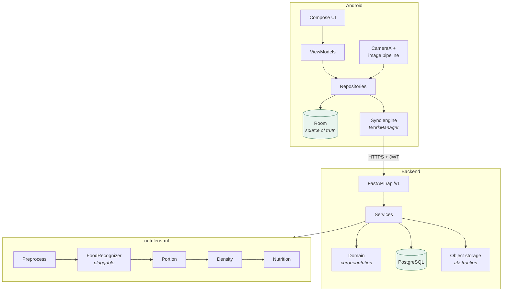

# NutriLens

**Snap your meal. Understand your meal.**

An Android application that estimates what is on a plate and how much of it
there is, from a single photograph, and tracks *when* a person eats as well as
what.

---

## Read this first

Every quantity NutriLens produces is an **estimate**, not a measurement.
Volume is inferred from one uncalibrated image, which cannot recover depth; mass
follows from volume through reference densities. Confidence values accompany
every figure and the interface always displays them.

**No accuracy has been measured.** There is no benchmark, no validation study
and no clinical evaluation behind this code, and no number in this repository
claims otherwise. NutriLens is a tracking and estimation tool. It does not
provide medical advice, diagnosis or treatment.

## Why it exists

Most food trackers ask *what* you ate. Chrononutrition -- the study of how meal
*timing* relates to metabolism -- needs *when*, at a resolution people will not
sustain by hand. NutriLens is built around that: a meal is a timestamp with a
zone first, and a list of foods second.

The photograph is the on-ramp. Estimating a portion from a picture is
error-prone, so the product is designed around that honestly: every number
carries its uncertainty, every number is correctable, and a correction is stored
as a correction so the estimator remains measurable after the fact.

## What is here

```
nutrilens/
├── android/     Kotlin, Compose, 15 modules, clean architecture
├── backend/     FastAPI, SQLAlchemy, PostgreSQL, Alembic
├── ml/          nutrilens-ml: recognition, portion, density, nutrition
├── docs/        architecture, API, ML, database, security, sync, deployment
├── scripts/     domain-module verification without the Android SDK
└── .github/     CI and release workflows
```

| | Tests | Runs without the Android SDK |
|---|---|---|
| `ml/` | 149 | yes |
| `backend/` | 177 | yes |
| `android/core/model` | 53 | yes |
| `android/**` (rest) | — | no |

## Architecture



The layering runs inwards in both the app and the backend: business rules at the
centre, I/O at the edges. `android/core/model` and `backend/app/domain` have no
framework dependency at all, which is why the chrononutrition rules can be
compiled and tested without an Android SDK or a database.

Full detail in **[docs/architecture.md](docs/architecture.md)**.

## Technology

| Layer | Choices |
|---|---|
| Android | Kotlin 2.0, Jetpack Compose, Material 3, CameraX, Room, DataStore, WorkManager, Hilt, Retrofit, OkHttp, kotlinx.serialization, Android Keystore |
| Backend | Python 3.11, FastAPI, Pydantic v2, SQLAlchemy 2, Alembic, PostgreSQL, Redis, python-jose, passlib, structlog |
| ML | numpy, Pillow, ONNX Runtime (optional) |
| Build | Gradle 8.11 with a version catalog, Docker, GitHub Actions |

Nothing is here for decoration. Redis backs cross-process rate limiting and is
optional. ONNX Runtime is an optional extra because no weights ship with this
repository.

## The AI pipeline

```
image → validate → strip metadata → segment → recognise
      → estimate volume → apply density → estimate nutrition
```

**Recognition is pluggable.** `FoodRecognizer` is a three-method interface, and
nothing above it knows what implements it.

- **Classical engine (default).** Real computer vision, no weights: adaptive
  HSV plate estimation, k-means over a hue-on-the-unit-circle feature space,
  connected-component labelling, perceptual region merging, then colour and
  texture matching against the food catalog. Deterministic. Its confidence is
  **capped below the "high" band** — a rule-based colour match must never carry
  a model's authority.
- **ONNX engine.** Genuine neural inference through `onnxruntime`. Point
  `NUTRILENS_ML_ONNX_MODEL_PATH` at a model and a label map and it takes over
  with no other change.

**No model weights ship here, deliberately.** An ImageNet classifier is not a
food-portion model, and bundling one would imply an accuracy nobody has
measured.

Portion estimation is the weakest link and the documentation says so: monocular
volume estimation is ill-posed, so a per-category effective-height model is
applied against a reference object, with a hard confidence ceiling of 0.85 and
explicit penalties for small, scattered or clamped estimates.

**[docs/ml-pipeline.md](docs/ml-pipeline.md)** covers every stage, its
assumptions and its limits.

## Offline-first

**A meal is never lost because the network was unavailable.** Writes commit to
Room and *then* request a sync, so `logMeal` does not fail when offline.

```
PENDING → SYNCING → SYNCED
             ↓
          RETRYING ⇄ FAILED
```

- Idempotency keys generated once per record and reused on every retry, so a
  request the server already applied is recognised rather than duplicated.
- Exponential backoff with **full jitter** — without it, every device that failed
  during an outage retries simultaneously and re-creates it.
- Permanent rejections do not consume the retry budget.
- A record that exhausts its retries is **never discarded**; it stays visible and
  retryable.
- A local change that has not reached the server always wins a conflict.
- `POST /sync/push` applies each operation independently, so one malformed meal
  cannot block a device's entire queue.

**[docs/offline-sync.md](docs/offline-sync.md)** has the state machine and the
conflict rules.

## Database

11 tables, UUID primary keys generated client-side (offline-first requires it),
soft deletion, and constraints enforced in the database rather than only in
application code.

Two decisions worth knowing up front:

- **Meals store both a UTC instant and an IANA zone.** Neither alone can answer
  "when in *your* day did you eat" across travel and DST.
- **AI predictions are stored apart from the final meal record**, so the model's
  original output survives every user correction and accuracy remains measurable
  after the fact.

**[docs/database.md](docs/database.md)** has the ER diagram and the reasoning.

## Security

Session tokens in Keystore-backed encrypted storage; nothing in cloud backup;
cleartext traffic refused; EXIF (including GPS) stripped from every photograph
before it leaves the camera stage; remote photo storage opt-in and off by
default; bcrypt passwords; 30-minute access tokens with rotating refresh tokens
stored only as SHA-256 fingerprints; per-address auth rate limiting; a redaction
processor on every log event.

**No security audit or penetration test has been performed.**

**[docs/security.md](docs/security.md)** has the threat model and what is *not*
claimed.

## Bilingual

English and Telugu, 173 keys each, with parity enforced. Telugu is written as
natural Telugu rather than a word-for-word rendering — "eating window" becomes
*ఆహారం తీసుకునే సమయం*, the time during which food is taken, because a literal
"window" would read as a window in a wall.

No user-facing string is hardcoded in Kotlin.

## Accessibility

Every size in `sp` so the interface scales with the reader's font setting;
generous line heights because Telugu glyphs are taller than Latin ones; 48 dp
minimum touch targets including icon-only buttons; content descriptions on every
non-decorative element; confidence never signalled by colour alone.

## Getting started

### Backend

```bash
cp .env.example .env
make secret          # paste into NUTRILENS_JWT_SECRET
make setup
make up              # API + PostgreSQL + Redis
```

<http://localhost:8000/docs>

Without Docker: `make setup && make migrate && make seed && make run`.

### Tests

```bash
make test            # 326 Python tests
make verify-domain   # 53 Kotlin tests, no Android SDK needed
make check           # lint + both of the above
```

### Android

Needs JDK 17 and the Android SDK (platform 35).

```bash
cd android
./gradlew test
./gradlew assembleDebug
# android/app/build/outputs/apk/debug/app-debug.apk
```

### Building the APK

```bash
# Debug
cd android && ./gradlew assembleDebug

# Release (needs a keystore; see docs/deployment.md)
cd android && ./gradlew assembleRelease
```

Install with `adb install -r android/app/build/outputs/apk/debug/app-debug.apk`.

The APK is also built and uploaded as an artifact by the `android` CI job on
every push.

## Build status in this repository

The Python and Kotlin-domain suites in the table above were run and pass. **The
Android application in this repository has not been compiled**, because the
environment it was written in has no access to Google's Maven repository
(`dl.google.com` is blocked by network policy), which is the only source of the
Android Gradle Plugin and every AndroidX artifact. Without them neither the
build nor the APK can be produced there.

What that means in practice:

- The Gradle configuration, module graph, manifest, resources and ProGuard rules
  are complete and the build commands above are the real ones.
- `android/core/model` — the domain layer, ~1,400 lines including the
  chrononutrition calculator and the retry policy — **is** compiled and tested
  by `make verify-domain`, which runs in CI and needs no Android SDK.
- The remaining Android modules are unverified by compilation. Expect to fix
  compilation errors on a first build.

This is stated here rather than buried because the honest status of a deliverable
matters more than the appearance of completeness.

## Known limitations

1. **No measured accuracy.** Nothing here has been benchmarked.
2. **Depth is unrecoverable from one image.** The height model is the dominant
   error term.
3. **Occlusion is invisible**, so layered servings are underestimated.
4. **The classical engine matches colour and texture, not food.** It cannot
   separate two similar-looking foods, which is why its confidence is capped.
5. **The food catalog has 12 entries**, weighted towards South Indian cuisine.
6. **Recognition requires connectivity.** Everything else works offline.
7. **Densities are compiled reference values**, not laboratory measurements.
8. **Local object storage does not scale beyond one node.** The abstraction is
   there; an S3 implementation is not.
9. **Rate limiting without Redis is per-process.**
10. **No Compose UI tests.** The harness is configured; the suite is not written.

## Where this would go next

In the order that would actually matter:

1. **Measure the current system** against weighed ground truth. Everything below
   is guesswork without it, and the schema already retains raw predictions
   alongside user corrections so it can be done retrospectively.
2. Train a real food classifier, export to ONNX, drop it in.
3. Replace classification with detection.
4. Attack the depth problem — ARCore depth, or a two-angle capture.
5. Move inference on-device.
6. Expand the catalog with a food composition database suited to the deployment
   population.

## Documentation

| | |
|---|---|
| [architecture.md](docs/architecture.md) | system and module structure, request paths |
| [api.md](docs/api.md) | endpoints, error contract, conventions |
| [ml-pipeline.md](docs/ml-pipeline.md) | every stage, its assumptions and its limits |
| [database.md](docs/database.md) | schema, indexes, constraints, migrations |
| [offline-sync.md](docs/offline-sync.md) | state machine, idempotency, conflicts |
| [security.md](docs/security.md) | threat model, controls, what is not claimed |
| [deployment.md](docs/deployment.md) | running the backend, building the APK |
| [testing.md](docs/testing.md) | what is tested, and what is not |

## Licence

Apache 2.0. See [LICENSE](LICENSE).
