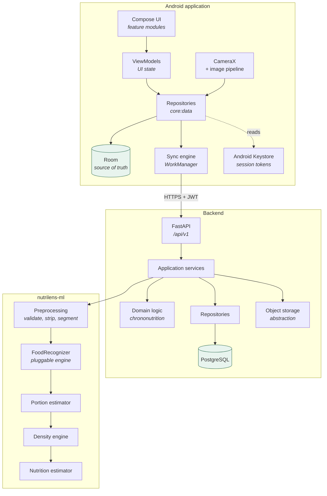
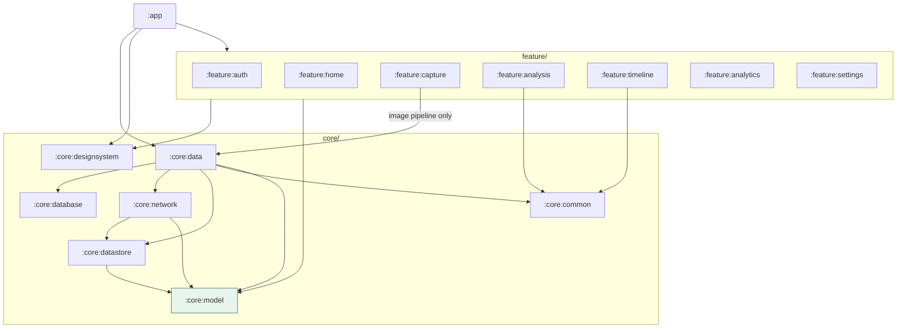
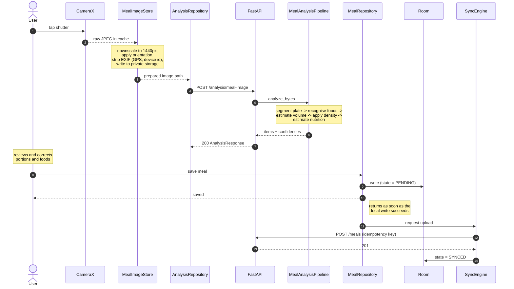
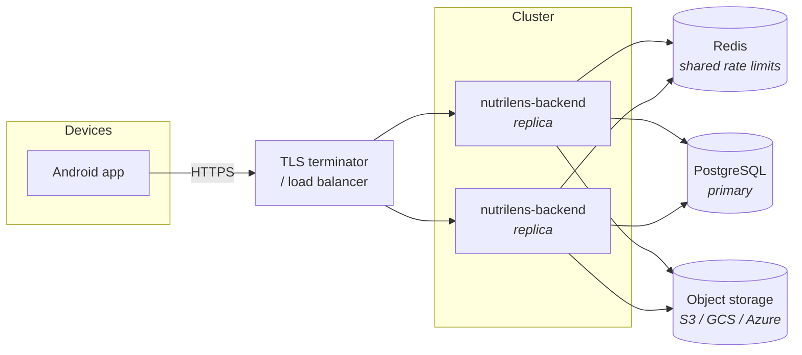

# Architecture

## The shape of the system



The three deliverables are independent:

| Component | Language | Depends on |
|---|---|---|
| `android/` | Kotlin | the HTTP contract only |
| `backend/` | Python | `nutrilens-ml` |
| `ml/` | Python | nothing in this repository |

`nutrilens-ml` is an installable package with no web-framework and no mobile
dependency. It can be imported by a notebook, a batch job or a different
service without dragging the API along.

## Why the layering runs inwards

Both the app and the backend put their business rules at the centre and their
I/O at the edges.

```
Android                          Backend
-------                          -------
feature:*        (Compose)       api/          (FastAPI routers)
   |                                |
core:data        (Room, HTTP)    services/     (use cases)
   |                                |
core:model       (pure Kotlin)   domain/       (pure Python)
                                    |
                                 repositories/ (SQLAlchemy)
```

The arrows point one way. `core:model` has no Android dependency at all -- it is
a plain JVM module, which is why its chrononutrition rules and retry policy can
be compiled and tested on any machine with a JDK and no Android SDK
(`scripts/verify-domain-module.sh`). The backend's `domain/` imports no
SQLAlchemy and no FastAPI, so the eating-window rules are testable without a
database.

This is not layering for its own sake. The concrete payoff:

- The recognition engine is replaceable because nothing above `FoodRecognizer`
  knows what implements it.
- The database is replaceable because repositories are the only code that
  imports SQLAlchemy.
- ViewModels are testable with hand-written fakes because they depend on
  interfaces declared in `core:model`, not on Room or Retrofit.

## Android module graph



Two properties of that graph are enforced, not aspirational:

**No feature module depends on another.** Every transition between screens is
expressed once, in `app/navigation/NutriLensApp.kt`, which is what keeps
features independently buildable.

**Feature modules do not depend on `core:data`.** They inject the repository
*interfaces* declared in `core:model`; the implementations are bound in
`core:data`, which only `:app` carries. Hilt still resolves everything, because
the component is generated in `:app`. The single exception is
`feature:capture`, which uses `MealImageStore` directly to process a captured
frame, and it is called out in the diagram.

`core:model` (highlighted) is the only module with no Android dependency.

## Request path: photographing a meal



Two properties of that sequence are load-bearing:

1. **The meal is saved before the upload is attempted.** `logMeal` returns once
   Room has the row. A missing network delays the upload; it cannot lose the
   meal.
2. **The photograph is sanitised before it leaves the camera stage.** Nothing
   downstream ever sees the original frame's GPS metadata, because the pipeline
   rebuilds the image from raw pixels.

## Where the rules actually live

| Rule | Implemented in | Also in |
|---|---|---|
| A logical day starts at 04:00 local | `ChrononutritionCalculator` (Kotlin) | `ChrononutritionEngine` (Python) |
| Window consistency = `1 - min(1, stdev/mean)` | same | same |
| Mass = volume x density | `DensityEngine` (Python) | app trusts the server's value |
| Confidence bands at 0.55 / 0.80 | `ConfidenceBand` (both) | -- |

The chrononutrition rules are deliberately implemented twice. The app must show
today's eating window the instant a meal is logged, including with no network,
and the server must compute the same figures for any other client. Both suites
assert the same worked example (08:42 to 19:16 = 10h34m eating, 13h26m fasting),
so a divergence fails a test rather than reaching a user.

Mass is *not* duplicated. The server recomputes it from volume and its own
density table on every write, because a device running an older catalog would
otherwise persist a mass that does not match its own recorded density.

## Concurrency

**Android.** Dispatchers are injected, never referenced statically, so tests
substitute a deterministic scheduler. Repository reads are cold `Flow`s from
Room; ViewModels convert them with `stateIn(WhileSubscribed)` so a backgrounded
screen stops collecting.

**Backend.** One request, one session, one transaction: `get_session` opens it
and commits on success, so a handler touching several repositories still gets
all-or-nothing semantics without managing it.

## Deployment



The API holds no per-request state, so replicas scale horizontally. The two
things that must be shared are called out above: Redis, because the in-memory
rate limiter gives each process its own budget, and object storage, because the
local filesystem backend does not survive more than one node.

See [deployment.md](deployment.md) for the operational detail.
