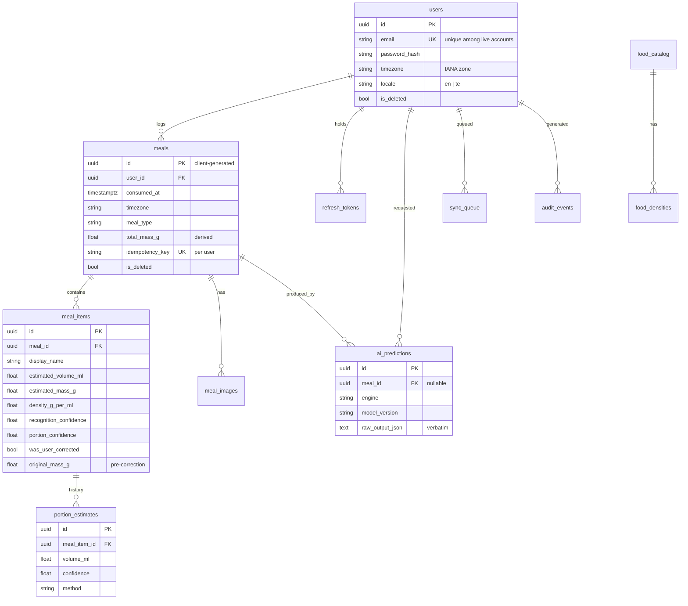

# Database

## Schema



## Decisions that carry weight

### UUID primary keys, generated by the client

Offline-first requires it. The phone mints a meal's id while it has no network,
and that same id is what the server stores. An autoincrement key would force the
device to wait for a server response before it had a stable identifier, which is
exactly the wait offline-first exists to remove.

### Both an instant and a zone on every meal

`consumed_at` is UTC; `timezone` is the IANA zone the user was in. Both are
needed:

- UTC alone cannot answer "when in *your* day did you eat".
- A local timestamp alone breaks across travel and DST.

The same instant is 07:30 on the 2nd in Kolkata and 22:00 on the 1st in New
York. Which day a meal belongs to is a question only the pair can answer, and
the test suites assert exactly that case.

### Uniqueness on email applies only to live accounts

```sql
CREATE UNIQUE INDEX uq_users_active_email ON users (email) WHERE is_deleted = false;
```

An absolute constraint would mean deleting an account permanently burns its
email address, so a person could never sign up again with the address they used
before. The partial index was adopted after a test caught precisely that.

### `(user_id, idempotency_key)` is unique on meals

This is what makes a retry safe. A client that never saw the response resends
the identical request; the server recognises it and returns the original meal
with `200` instead of creating a second one with `201`.

A deliberate subtlety: the lookup includes soft-deleted rows. Replaying an
original create must not resurrect a meal the user has since deleted.

### Soft deletion, with one exception

Meal history is the product, so `is_deleted` is set rather than the row removed.
Two reasons beyond undo: sync needs to *tell* other devices about a deletion,
and a row that simply vanished would leave a stale copy on a device forever.

The exception is a locally-deleted meal that never reached the server. There is
nothing to inform, so the row is purged outright.

### AI predictions are stored apart from the final record

`ai_predictions` keeps the engine's verbatim structured output; `meal_items`
holds what the user ended up with. Keeping them separate is what makes the
system evaluable: the model's original answer survives every subsequent user
edit, so accuracy can be measured later against what the person said they ate.

`meal_items.original_mass_g` and `original_display_name` carry the same
information inline, so a correction is visible as a correction in the UI.

### Portion estimates are append-only

`portion_estimates` is never updated in place. The sequence "the model said 180
ml, then the user said 100 ml" is exactly the signal needed to evaluate the
estimator later.

### Totals are derived, never accumulated

`meals.total_mass_g` is recomputed from live items on every change. Incremental
accumulation would drift permanently out of step after one edit or deletion.

### Mass is recomputed server-side on every write

The client sends a volume; the server derives the mass from volume and its own
density table. A device running an older catalog would otherwise persist a mass
that does not match its own recorded density, which would be unauditable.

## Indexes

| Index | Serves |
|---|---|
| `ix_meals_user_consumed_at` | the timeline, newest first |
| `ix_meals_user_active_consumed` | the timeline excluding deleted rows |
| `uq_meals_user_idempotency_key` | replay detection on every write |
| `ix_meal_items_meal` | loading a meal's items |
| `ix_ai_predictions_engine_version` | comparing engine versions during evaluation |
| `uq_users_active_email` | login, and re-registration after deletion |
| `ix_refresh_tokens_user_active` | revoking every session for a user |

## Constraints

Enforced in the database, not only in application code, because a bug in a
service should not be able to persist a nonsensical row:

```sql
CHECK (estimated_mass_g > 0)
CHECK (estimated_volume_ml > 0)
CHECK (recognition_confidence BETWEEN 0 AND 1)
CHECK (portion_confidence BETWEEN 0 AND 1)
CHECK (density_g_per_ml > 0 AND density_g_per_ml < 3)
CHECK (total_mass_g IS NULL OR total_mass_g >= 0)
```

The density bound is physical: nothing edible sits outside it, so a value that
does is a bug rather than an unusual food.

SQLite ignores foreign keys unless asked, so the engine turns them on per
connection. Without that, the test suite would pass against constraints
production actually enforces.

## Migrations

Alembic, with deterministic constraint naming so autogenerated migrations are
stable across environments rather than inventing names per machine.

```bash
make migrate                              # apply
make migration MESSAGE="add meal tags"    # autogenerate
```

CI applies the migration against a real PostgreSQL instance **and rolls it
back**: a migration that cannot be reversed is a migration that cannot be safely
deployed.

Autogenerated revisions import `app.core.database` because custom column types
(`GUID`, `UTCDateTime`) are rendered with their full module path. The revision
template includes that import so a generated file is never broken on arrival.

## On-device schema

Room mirrors the server's shape with the sync columns the device needs:

| Table | Notes |
|---|---|
| `meals` | plus `syncState`, `syncAttempts`, `nextAttemptAtEpochMillis`, `idempotencyKey` |
| `meal_items` | cascade delete from `meals` |
| `food_catalog` | cached, so food correction works offline |
| `sync_queue` | operations other than meal creation |

`exportSchema = true` writes the schema JSON into `core/database/schemas/`,
which is committed. That file is what makes a future migration reviewable and
what Room's migration tests run against.

**No destructive-migration fallback is configured anywhere.** Wiping a user's
meal history to avoid writing a migration is not an acceptable trade.
