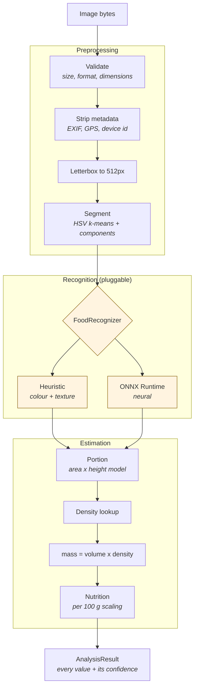

# The AI pipeline

## What this actually does

NutriLens estimates what is on a plate and how much of it there is, from one
photograph. This document is precise about which parts are measured, which are
estimated, and which are assumed, because the difference matters to anyone
deciding whether to trust a number.

**No accuracy figure appears anywhere in this repository.** None has been
measured. There is no benchmark result, no validation study and no clinical
evaluation behind any of this code, and the app is built so it never implies
otherwise.

## The stages



## Stage 1 -- preprocessing

Real algorithms, no model required.

**Validation** rejects an image before it is decoded where possible: byte size,
declared MIME type, then sniffed format, then dimensions, then a pixel-count
ceiling. The declared content type is never trusted on its own; the decoder's
verdict decides. Decoding bounds before pixels means a decompression bomb is
refused rather than allocated.

**Metadata stripping** rebuilds the image from raw pixel bytes after applying
the EXIF orientation. That drops EXIF, ICC and XMP in one step rather than
enumerating what to remove -- and meal photographs routinely carry GPS
coordinates and a device identifier.

**Segmentation** (`preprocessing/segmentation.py`) is classical computer vision:

1. RGB to HSV, vectorised.
2. Estimate the scene: bare-plate pixels are bright and unsaturated *relative to
   this image* (adaptive quantile thresholds, not an assumption of white
   crockery); the frame edge is treated as table. The plate surface is the bare
   plate plus the food on it.
3. k-means over a feature space of `(cos(h)*s, sin(h)*s, v, y, x)`. Hue is
   encoded on the unit circle so red near 0 degrees and red near 360 cluster
   together; position is included at low weight so one dish is not split by
   colour noise.
4. 4-connected component labelling per cluster.
5. Merge adjacent, perceptually similar components -- k-means partitions colour
   space, so a dish straddling a cluster boundary comes back as two regions and
   would otherwise be reported (and counted) as two foods.

A guard runs before any of this: if the frame's colour and brightness dispersion
is below a threshold, segmentation returns nothing. k-means will happily
partition noise, and a lens cap must not produce a confident "rice".

Everything is deterministic. The same photograph produces the same analysis, for
user trust and for reproducible tests.

## Stage 2 -- recognition

`FoodRecognizer` is a three-method interface: `name`, `model_version`,
`recognize`. Nothing above it knows what implements it.

### The classical engine (default)

`HeuristicFoodRecognizer` scores each segmented region against colour signatures
in the food catalog. It computes real statistics from real pixels -- mean hue on
the colour circle, saturation, value, and a 3x3 local-contrast texture score --
and combines them with documented weights.

Two deliberate constraints:

- **Its confidence is capped at 0.72**, below the "high" band. A rule-based
  colour match must never be presented with a model's authority.
- **Its accuracy is unmeasured and it is not a neural network.** It exists so
  the product has a dependable, weight-free path that runs everywhere, and so
  the whole pipeline can be exercised end to end.

### The ONNX engine (production path)

`OnnxFoodRecognizer` performs genuine neural inference through `onnxruntime`:
normalises each crop to the model's mean/std, runs the session, softmaxes the
logits, and maps labels through a JSON label map to catalog foods.

**No weights ship with this repository, deliberately.** An ImageNet classifier
is not a food-portion model, and bundling one would imply an accuracy nobody has
measured. To supply your own:

```bash
export NUTRILENS_ML_ENGINE=onnx
export NUTRILENS_ML_ONNX_MODEL_PATH=/models/food-cls-v1.onnx
export NUTRILENS_ML_ONNX_LABEL_MAP_PATH=/models/food-cls-v1.labels.json
```

```json
{
  "model_version": "food-cls-v1",
  "input_name": "input",
  "input_layout": "NCHW",
  "mean": [0.485, 0.456, 0.406],
  "std": [0.229, 0.224, 0.225],
  "labels": ["rice", "dal", "vegetable_curry"]
}
```

Every label must resolve against the food catalog by key, display name or alias.

Engine selection (`inference/factory.py`) has one behaviour worth stating:
`auto` falls back to the classical engine when no model is present, but explicit
`onnx` **refuses to start** without one. A deployment that believes it is
running a model must never quietly run rules instead.

### Replacing the engine entirely

Implement `FoodRecognizer`, register it in the factory. Nothing else changes --
not the services, not the API, not the app. A detection model (rather than a
classifier over classical segmentation) fits the same interface: it would
produce its own regions instead of consuming `segment_plate`'s.

## Stage 3 -- portion estimation

**This is the weakest link in the system, and the documentation says so.**

Monocular volume estimation is ill-posed. One image does not determine depth.
Everything here is an estimate built on stated geometric assumptions, and the
confidence degrades as those assumptions weaken.

### Reference mode

With an object of known real-world size in frame:

```
real_area_cm2 = region_area_ratio x (reference_area_cm2 / reference_image_ratio)
volume_ml     = real_area_cm2 x category_mean_height_cm
```

The height model is the crux. Depth cannot be recovered, so each category gets
an *effective mean height*: the height of a uniform slab with the same volume as
the real, mounded serving.

| Category | Assumed mean height |
|---|---|
| solid | 2.2 cm |
| semisolid | 2.6 cm |
| liquid | 4.0 cm |

These are typical plating heights, not measurements.

By default the detected plate is used as an implicit 26 cm reference -- but only
when it occupies between 12% and 92% of the frame. Outside that band the implied
scale is worse than the serving prior, so the prior is used instead.

### Prior mode

With no usable reference, the estimate falls back to typical servings (200 ml
solid, 150 ml semisolid, 200 ml liquid) scaled by the region's share of the
plate. Confidence is capped at 0.42, because this is barely more than a prior.

### Confidence

Reference mode maps the reference's own trustworthiness onto
`[ceiling/2, ceiling]` with a **hard ceiling of 0.85**. Even a perfect reference
object leaves real uncertainty in the height model, so no portion estimate is
ever allowed to look certain.

It is then reduced for:

| Condition | Factor | Why |
|---|---|---|
| region < 3% of frame | x0.7 | dominated by segmentation error |
| mask fills < 45% of its bbox | x0.8 | scattered or badly segmented |
| volume hit a clamp | x0.5 | the geometry produced something implausible |

A user correction supersedes all of it at 0.9 -- high, but not 1.0, because the
person is also estimating.

## Stage 4 -- density and mass

```
mass_g = volume_ml x density_g_per_ml
```

Resolution order, with the result always carrying its provenance:

1. exact catalog entry (key, display name or alias) -- confidence 0.5 to 0.98
2. category default -- confidence **0.35**, flagged `is_fallback_density`
3. refusal, when no category is supplied

The fallback confidence is deliberately below every catalog entry's, and the
flag travels all the way to the UI, which tells the user in plain language that
the figure rests on a generic assumption.

Densities are compiled reference values, approximate, and are **not laboratory
measurements**. The dataset says so in its own `notice` field. Replace
`ml/nutrilens_ml/datasets/food_catalog.json` with an institution-approved food
composition database before any study use.

## Stage 5 -- nutrition

A linear scaling of catalog values per 100 g. It inherits every uncertainty of
the mass estimate that feeds it, plus the variance of the recipe itself.

Unknown foods return `null`, never zeros. "We do not know" and "no calories"
must not be confusable, and the app carries that distinction through to the
screen.

## How uncertainty reaches the user

Three confidences travel with every item and are combined multiplicatively:

```
overall = recognition x portion x density
```

Multiplicative because the stages are independently fallible: a perfect food
match on an unmeasurable portion is not a confident mass.

Bands are shared by the app and the server at exactly the same thresholds:

| Band | Range |
|---|---|
| low | < 0.55 |
| medium | 0.55 -- 0.80 |
| high | >= 0.80 |

In the app, colour is never the only signal: every confidence indicator carries
its label and a spoken description, so the meaning survives colour blindness and
a screen reader. The API response includes `estimates_are_approximate: true` as
a permanent field of the contract.

## Known limitations

These are real, and none of them is hidden in the product:

1. **No measured accuracy.** Nothing here has been benchmarked. Any number
   describing how well it works would be invented.
2. **Depth is unrecoverable.** The height model is the dominant error term, and
   a tall mound and a thin layer of the same footprint estimate identically.
3. **Occlusion is invisible.** Food beneath other food is not seen, so layered
   servings are systematically underestimated.
4. **The classical engine matches colour, not food.** It cannot distinguish two
   foods of similar colour and texture, which is precisely why its confidence is
   capped below the high band.
5. **The catalog is small.** Twelve foods, weighted towards South Indian
   cuisine. Anything outside it falls back to a category density.
6. **Recognition needs a network.** Inference runs server-side. The app says so
   plainly and offers manual logging rather than blocking the user.
7. **Densities are reference values, not measurements.**

## Improving this

In the order that would actually move the accuracy:

1. **Measure the current system.** Collect a labelled set of meal photographs
   with weighed ground truth. Everything below is guesswork without it, and
   `ai_predictions` already stores the raw model output alongside each user
   correction precisely so this is possible after the fact.
2. **Train a real food classifier** and export it to ONNX. The interface is
   already there.
3. **Replace classification with detection** (segmentation masks per food).
   Same interface.
4. **Attack the depth problem**, which is the largest error source: ARCore depth
   on supported devices, or a two-angle capture.
5. **Move inference on-device** with TensorFlow Lite or ONNX Runtime Mobile.
   `FoodRecognizer` is a Python interface, so this means a Kotlin equivalent in
   `core:data` -- the repository boundary already isolates it.
6. **Expand the catalog** with a food composition database appropriate to the
   deployment population.
