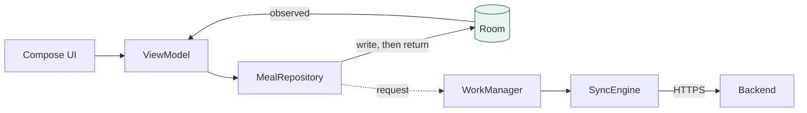
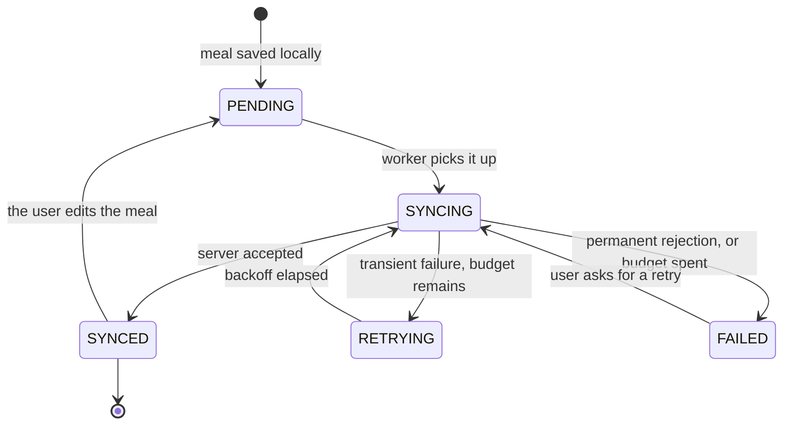
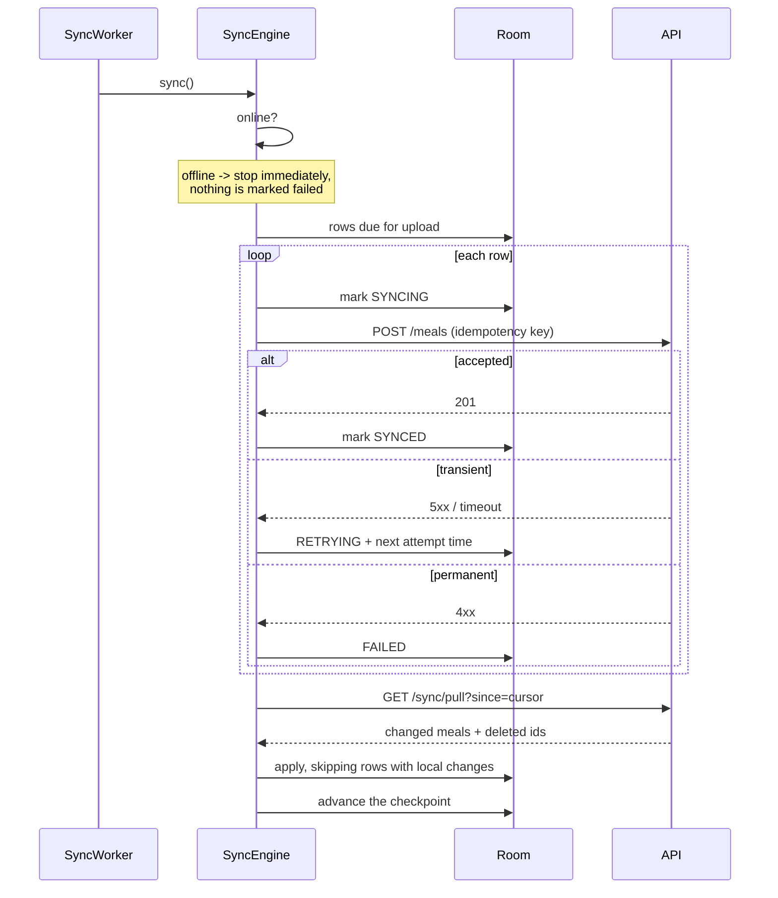

# Offline synchronisation

## The guarantee

**A meal is never lost because the network was unavailable.**

Everything below exists to make that true. It is not a best-effort claim: the
write path is ordered so that losing a meal to a missing network is not a state
the system can reach.

## Local database is the source of truth



Reads observe Room. Writes commit to Room and *then* ask for a sync. `logMeal`
returns as soon as the local write succeeds, so it does not fail when offline --
there is no code path in which a failed upload discards a meal.

The UI renders from disk, so the app is fully usable with the radio off. The one
exception is recognition, which runs server-side; the app says so plainly and
offers manual logging rather than blocking the user.

## The state machine



| State | Meaning |
|---|---|
| `PENDING` | saved on device, not yet sent. The meal is already fully usable. |
| `SYNCING` | an attempt is in flight |
| `SYNCED` | the server has acknowledged it |
| `FAILED` | permanently rejected, or out of retries. **Still on the device.** |
| `RETRYING` | queued for another attempt after backoff |

`SYNCING` is excluded from the upload query. Picking up a row mid-flight would
upload the same meal twice concurrently.

An edit moves a `SYNCED` meal back to `PENDING`: the server's copy is now stale
and the record owes another upload.

## Idempotency

Every meal carries an idempotency key, generated **once** when the row is
created and stored on it.

That is the whole mechanism. A client that never saw the response resends the
identical request; the server finds the key and returns the original meal with
`200` instead of creating a second one. Regenerating the key per attempt would
defeat server-side deduplication and produce one meal per retry.

The server's `(user_id, idempotency_key)` unique constraint enforces it in the
database, not only in application code.

A subtlety the test suite pins down: the lookup includes soft-deleted rows.
Replaying an original create must not resurrect a meal the user has since
deleted.

## Retry policy

Exponential backoff with **full jitter**:

```
delay = random(0, min(base x 2^(attempts-1), cap))
```

| Parameter | Default |
|---|---|
| base | 2 s |
| cap | 5 min |
| max attempts | 8 |

Jitter matters more than it looks. Without it, every device that failed during
the same outage retries at the same instant and re-creates the outage the moment
the server recovers. Full jitter spreads them uniformly across the window.

The cap exists so a long-offline device retries promptly once it reconnects
rather than sitting out an hours-long backoff.

**A permanent rejection does not consume the retry budget.** `AppError` knows
which failures are retryable; a `401` or a validation error fails identically
forever, and spending eight retries on it only delays telling the user.

**A record that exhausts its retries is never discarded.** It stays `FAILED`,
visible, and the user can ask for another attempt. Losing a meal to a retry
budget would defeat the entire point of storing it locally first.

There are two independent retry mechanisms, on purpose: per-record backoff
inside the engine, and WorkManager's own backoff for the whole pass.

## Push before pull



Local work is uploaded first so a pull cannot overwrite a meal the user just
logged with a stale server copy.

## Conflict resolution

**A local change that has not reached the server always wins.**

```kotlin
if (local != null && parseState(local.meal.syncState).isOutstanding) continue
```

The reasoning: an unsynced local change is newer *intent* than anything the
server holds, because the server has not seen it yet. Overwriting it would
silently discard something the user did.

This is last-write-wins with a local bias, not a merge. It is the right trade
for single-user meal records, where concurrent edits from two devices are rare
and losing the user's most recent action is the worst outcome. A multi-user or
collaborative model would need something stronger.

Deletions are pulled explicitly in `deleted_meal_ids` rather than inferred from
absence -- a row that just vanished from the feed would leave a stale copy on the
device forever.

## Partial batch failure

`POST /sync/push` validates and applies **each operation independently**. One
malformed meal reports `failed`; the rest still apply.

This is why the embedded meal is deliberately not validated at the batch schema
level. Doing so would return `422` for the whole request, and a device holding
one bad record could then never sync any of its good ones -- exactly the failure
per-operation keys exist to prevent.

## Connectivity

`NetworkConnectivityObserver` requires `NET_CAPABILITY_VALIDATED`, not merely
that a network exists. A captive portal or a connected-but-dead Wi-Fi network
would otherwise look online and send the engine into a retry loop it cannot win.

## Scheduling

| Trigger | Policy |
|---|---|
| periodic, every 30 min | `KEEP` -- replacing on each launch would reset the interval, so a frequently-opened app would never actually run it |
| after logging a meal | `APPEND_OR_REPLACE` -- rapid triggers collapse into one pass |
| pull to refresh | same |

Both require `NetworkType.CONNECTED`, so the system does not wake the app to
fail.

WorkManager's own initializer is removed in the manifest and the application
provides the configuration, because a worker cannot otherwise receive injected
dependencies and the sync worker needs the whole data layer.

## What the user sees

"3 meals waiting to upload" -- a count and a timestamp, not a spinner. The user's
real question is whether their data is safe, and a count answers it honestly
while an indeterminate spinner does not.

The row appears only when there is something to say. A permanent "all synced"
badge is noise people learn to ignore.

## Verified by

| Behaviour | Test |
|---|---|
| replay creates no duplicate | `test_meals_api.py::TestIdempotency` |
| a replay does not resurrect a deleted meal | same |
| one bad operation does not lose the others | `test_sync_api.py::TestPush` |
| the batch key overrides an embedded one | same |
| deletions are reported, not omitted | `test_sync_api.py::TestPull` |
| a cursor excludes what was already seen | same |
| backoff grows, caps and jitters | `RetryPolicyTest` (runs in CI) |
| permanent errors are not retried | `OutcomeTest`, `SyncEngineTest` |
| `SYNCING` is excluded from the queue | `SyncEngineTest` |
